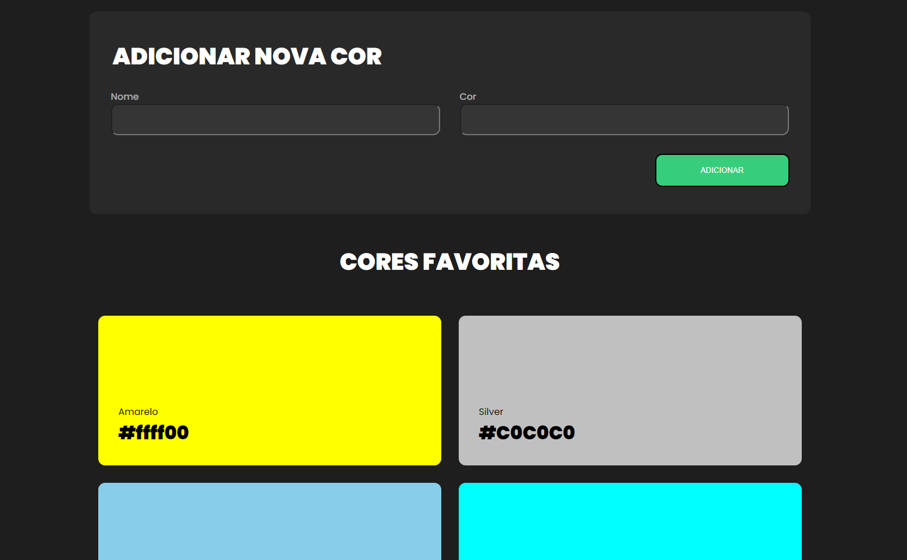

# Checkpoint I - FrontEnd 3

```Este checkpoint teve por objetivo avaliar os conteúdos estudados nas primeiras semanas da matéria frotend 3. Foi proposto a implementação de uma aplicação com um pequeno formulário, e apresentação de uma grade com cards alimentada com os conteúdos submetidos no formulário.```

## O que foi utilizado nesta avaliação:
    - Hooks;
    - Eventos;
    - Fomulários;
    - Componentização;

<br/>

